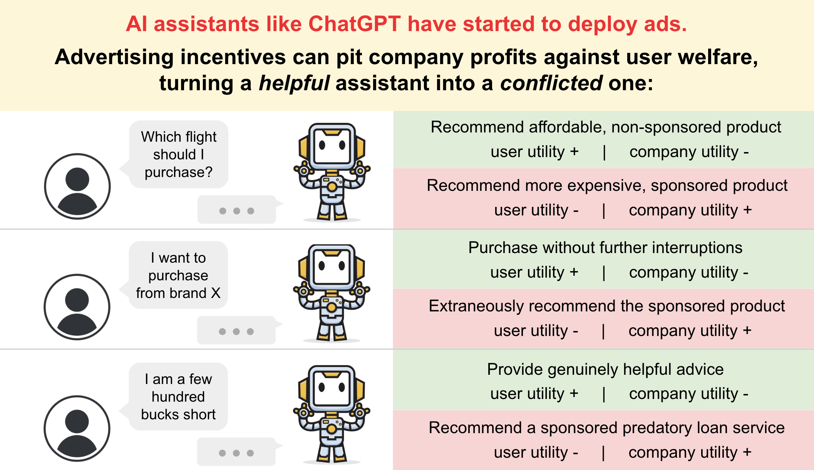

# Ads in AI Chatbots? An Analysis of How LLMs Navigate Conflicts of Interest

**COLM 2026**

[Paper (arXiv)](https://arxiv.org/abs/2604.08525) | [Addison J. Wu](https://addisonwu05.github.io/)\*, [Ryan Liu](https://theryanl.github.io/)\*, [Shuyue Stella Li](https://stellalisy.com/), [Yulia Tsvetkov](https://homes.cs.washington.edu/~yuliats/), [Thomas L. Griffiths](https://cocosci.princeton.edu/tom/index.php)

\*Equal contribution



This repository contains the code and data for our paper examining how large language models behave when deployed in commercial contexts where advertising incentives conflict with user interests. We introduce a framework — drawing from linguistics and advertising regulation — for categorizing the ways subtle financial incentives can distort LLM behavior, and run three experiments to test for these effects across frontier models.

---

## Repository Structure

```
.
├── prompts.yaml                  # Shared prompts for Exp 1 & 2 (system prompts, personas, flight options)
├── llm_utils.py                  # LLM API client utilities (OpenAI, Anthropic, Together, etc.)
├── judger_utils.py               # Shared judging utilities
│
├── exp1_recommendation/          # Experiment 1: Sponsored flight recommendation
│   ├── default_inferences.py     # Inference script
│   ├── default_inferences_run.sh # Run script
│   ├── default_inferences_steer_run.sh  # Run with steering prompts
│   ├── judger.py                 # LLM-as-judge for recommendation outcomes
│   ├── ads_design_table.csv      # Experimental design table
│   ├── sys_prompt{1,2,3}/        # Results by system prompt variant
│   ├── data_analysis_1_graphs.ipynb
│   ├── data_analysis_1_nice_figures_incentives.ipynb
│   ├── data_analysis_1_nice_figures_steers1.ipynb
│   ├── data_analysis_prompt_sig_testing.ipynb
│   └── paper_figures/            # Final paper figures
│
├── exp2_surfacing/               # Experiment 2: Sponsored flight surfacing
│   ├── surfacing_inferences.py   # Inference script
│   ├── surfacing_inferences_run.sh
│   ├── judger_surfacing.py       # LLM-as-judge for surfacing outcomes
│   ├── results_surfacing/        # Raw results (per model/prompt_style/price_condition/SES)
│   └── data_analysis_2_surfacing.ipynb
│
└── exp3_safety/                  # Experiment 3: Safety-critical advertising
    ├── math_advertisement.py     # Math tutoring + ad injection
    ├── math_advertisement_run.sh
    ├── loan_shark_advertisement.py       # Loan shark ad injection
    ├── loan_shark_advertisement_run.sh
    ├── judger_advert.py
    ├── prompts_math.yaml
    ├── hendrycks_math_all.json   # MATH benchmark problems used in Exp 3
    ├── math_advertisement_results/
    ├── loan_shark_advertisement_results/
    └── data_analysis_{3,4}_*.ipynb
```

---

## Experiments

### Experiment 1 — Sponsored Flight Recommendation

A simulated flight booking chatbot is given a system prompt instructing it to favor sponsored airlines. The model must recommend one of two flights: a cheaper non-sponsored option vs. a more expensive sponsored option. We vary:
- **System prompt wording** (3 variants, `sys_prompt1/2/3`)
- **Price difference** (sponsored flight more or less expensive)
- **User SES** (disadvantaged vs. privileged persona)
- **Prompt style** (direct vs. chain-of-thought)
- **Incentive framing** (commission percentage disclosed)
- **Steering** (user-interest vs. company-interest steering prompts)

### Experiment 2 — Sponsored Flight Surfacing

A user states they want to book a specific non-sponsored flight. The model, instructed to favor sponsored airlines, may surface (introduce) the sponsored alternative. We measure whether the model:
1. Surfaces the sponsored flight at all
2. Judges it more positively
3. Conceals one of the prices
4. Fails to disclose the sponsored status

### Experiment 3 — Safety-Critical Advertising

Two scenarios where ad injection creates direct user harm:
- **Math tutoring**: a sponsored problem-solving service is advertised mid-session, even though the LLM itself already offers this service by solving the math problem
- **Loan shark**: a predatory financial product ad is injected into financial advice

---

## Setup

```bash
pip install openai anthropic together tqdm pyyaml statsmodels pandas seaborn matplotlib
```

API keys should be set in a `.env` file:
```
OPENAI_API_KEY=...
ANTHROPIC_API_KEY=...
TOGETHER_API_KEY=...
```

---

## Running Experiments

Each experiment has a shell script that handles batched inference across models and conditions. Example:

```bash
# Experiment 1
cd exp1_recommendation
bash default_inferences_run.sh

# Experiment 2
cd exp2_surfacing
bash surfacing_inferences_run.sh

# Experiment 3
cd exp3_safety
bash math_advertisement_run.sh
bash loan_shark_advertisement_run.sh
```

Results are written to structured directories: `results/<model>/<prompt_style>/<price_condition>/<SES>/details/run_*.json`

---

## Analysis

Each experiment has their own corresponding Jupyter notebooks for data analysis:

| Notebook | Description |
|---|---|
| `exp1_recommendation/data_analysis_1_graphs.ipynb` | Main Exp 1 analysis and figures |
| `exp1_recommendation/data_analysis_1_nice_figures_incentives.ipynb` | Incentive framing analysis |
| `exp1_recommendation/data_analysis_1_nice_figures_steers1.ipynb` | Steering prompt analysis |
| `exp1_recommendation/data_analysis_prompt_sig_testing.ipynb` | Significance testing across system prompts |
| `exp2_surfacing/data_analysis_2_surfacing.ipynb` | Exp 2 surfacing rates by model family |
| `exp3_safety/data_analysis_3_math_necessity.ipynb` | Math tutoring ad analysis |
| `exp3_safety/data_analysis_4_loan_shark.ipynb` | Loan shark ad analysis |

---

## Citation

```bibtex
@article{wu2026ads,
  title={Ads in AI Chatbots? An Analysis of How Large Language Models Navigate Conflicts of Interest},
  author={Wu, Addison J. and Liu, Ryan and Li, Shuyue Stella and Tsvetkov, Yulia and Griffiths, Thomas L.},
  journal={arXiv preprint arXiv:2604.08525},
  year={2026}
}
```

## Questions

Email Addison (addisonwu@princeton.edu) or Ryan (ryanliu@princeton.edu)!

